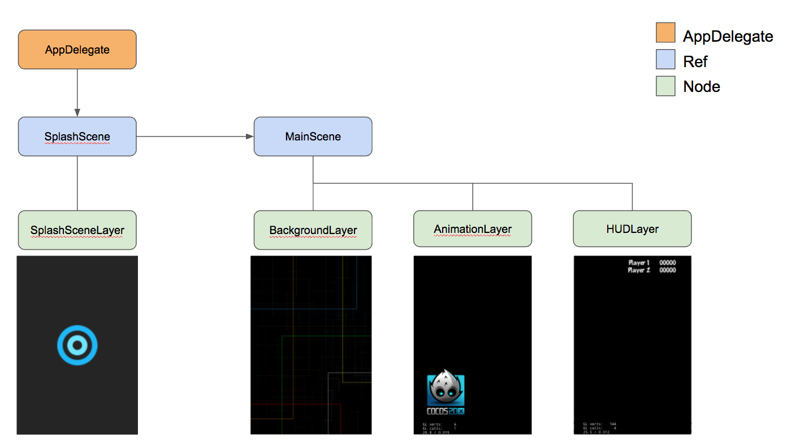

# Cocos2dXBaseGame

Base project to show the new way of inheriting for cocos2d-3.x as Layer is being deprecated regarding documentation (http://www.cocos2d-x.org/wiki/Layer)

Two points are covered in this repo:

* Instead of inheriting Scene, the code is inheriting Ref with no logic inside
* Instead of inheriting Layer, the code is inheriting Node with logic inside.

Ref is only going to work as a wrapper scene and everything inside will be wrap into a node (acting as a layer)
